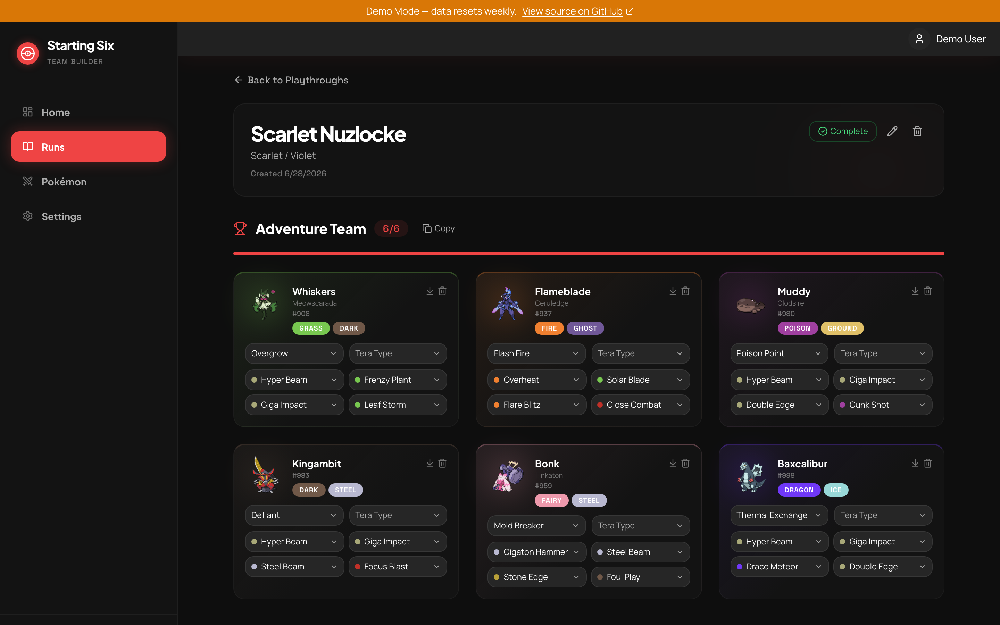
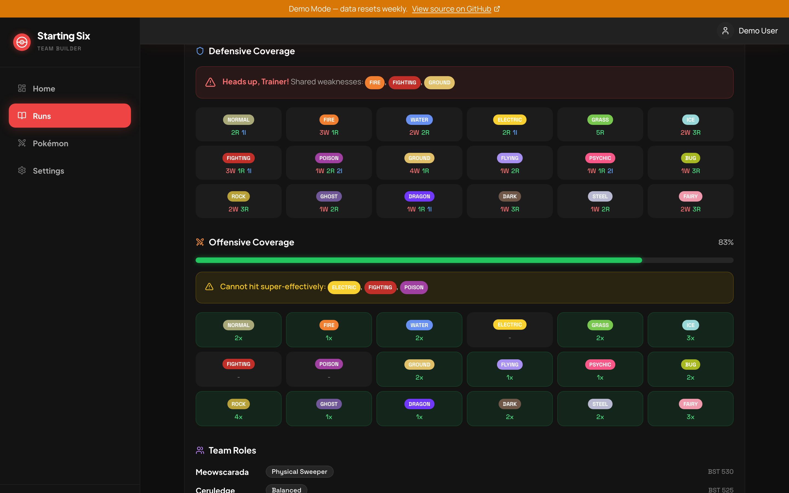
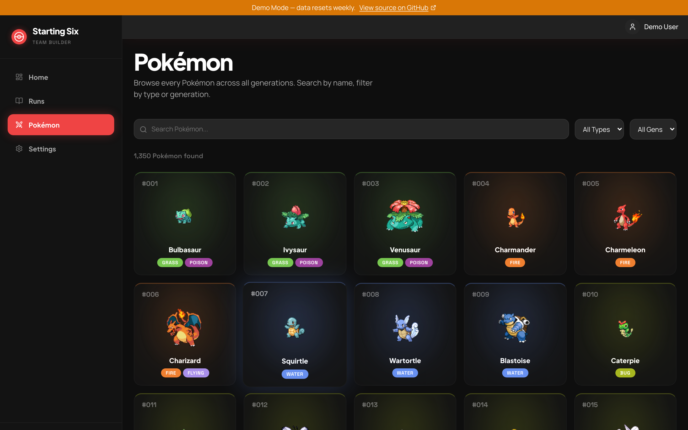

# Starting Six

[](https://github.com/smithadifd/starting-six/actions/workflows/ci.yml)
[](LICENSE)

Plan your Pokemon playthrough team before you start the game.

### Team Builder



### Type-Coverage Analysis



### Pokemon Browser



## Live Demo

**[Try it live at starting-six.smithadifd.com](https://starting-six.smithadifd.com)**

Log in with `demo@example.com` / `demo1234!`. Data resets weekly and mutations (sync, settings changes, registration) are disabled.

> The demo tracks `main`: it rebuilds and redeploys automatically within ~5 minutes of every merge, and its data volume is wiped and reseeded every Sunday at 4am UTC — so don't rely on anything you create there sticking around.
>
> Type matchups use the **Gen 9** type chart (18×18). If you're planning an older-generation playthrough, a few matchups will differ from what your game actually uses (e.g. pre-Gen-6 Steel resistances, pre-Gen-2 type interactions).

## Why This Exists

Every Pokemon game starts the same way: you pick a starter, catch what looks cool, and end up with a team that has three Water types and nothing for the Elite Four. Starting Six lets you plan your full team in advance — see type coverage gaps, check move pools, and make sure your squad actually works together before you commit 40 hours to a playthrough.

## Tech Stack

| Layer | Technology |
|-------|------------|
| Framework | Next.js 16 (App Router) / TypeScript |
| Database | SQLite via Drizzle ORM + better-sqlite3 |
| Styling | Tailwind CSS + shadcn/ui |
| Data Source | PokeAPI (bulk sync to local DB) |
| Auth | Better Auth (credentials-based) |
| Testing | Vitest (138 tests across 10 suites) |
| Deployment | Docker Compose |

## Architecture

All Pokemon data syncs from PokeAPI into a local SQLite database on first run. The UI reads exclusively from the database — no live API calls during normal use.

```
PokeAPI  -->  bulk sync  -->  SQLite  <--  UI reads
                                ^
                                |
                          user data
                      (playthroughs, teams)
```

Key design decisions:
- **Cache-first**: Bulk sync ~1,000 Pokemon + moves + abilities once, then operate offline
- **SQLite**: Single-file database, zero infrastructure, perfect for self-hosting
- **Pure analysis engine**: Type matchups, coverage gaps, and role analysis computed from a hand-coded 18x18 type effectiveness matrix — no external dependencies

## Features

- **Pokemon Browser** — Search and filter all Pokemon by name, type, generation, and stats
- **Playthrough Management** — Create playthroughs tied to specific games, each with a 6-slot team
- **Team Builder** — Add Pokemon to your team with specific moves, abilities, and Tera types
- **Type Analysis Engine** — Defensive/offensive coverage, team weaknesses, role distribution, and gap detection
- **Move & Ability Selection** — Browse each Pokemon's full learnset and ability pool
- **PWA** — Installable as a mobile app, works offline after initial sync
- **Self-hosted** — Runs on your own hardware, your data stays local

## Quick Start

### Docker (recommended)

```bash
git clone https://github.com/smithadifd/starting-six.git
cd starting-six
cp .env.example .env.local

# Edit .env.local — set BETTER_AUTH_SECRET (openssl rand -base64 32)

docker compose up -d
```

The app will be available at `http://localhost:3000`. On first launch, you'll create an account and trigger the PokeAPI data sync.

### Local Development

```bash
git clone https://github.com/smithadifd/starting-six.git
cd starting-six
cp .env.example .env.local

# Edit .env.local — set BETTER_AUTH_SECRET

npm install
npm run db:push
npm run dev
```

## Testing

The suite covers **138 tests across 10 suites** — mostly the pure analysis engine (type coverage, roles, abilities) plus validations and demo-mode gating. CI runs lint, tests, and a production build on every push and PR.

```bash
npm test              # Run all 138 tests
npm run test:watch    # Watch mode
npm run test:coverage # With coverage report
```

## Contributing

Contributions and bug reports are welcome. See **[CONTRIBUTING.md](CONTRIBUTING.md)** for setup, conventions, testing, and the CI gates — and note the auto-deploy-on-`main` behavior described there before you open a PR.

## Support This Project

Starting Six is free and self-hostable. If it's useful to you and you'd like to say thanks:

- ❤️ [GitHub Sponsors](https://github.com/sponsors/smithadifd)
- ☕ [Ko-fi](https://ko-fi.com/smithadifd)

## License

[MIT](LICENSE)

---

Built with [Claude Code](https://claude.ai/code)
