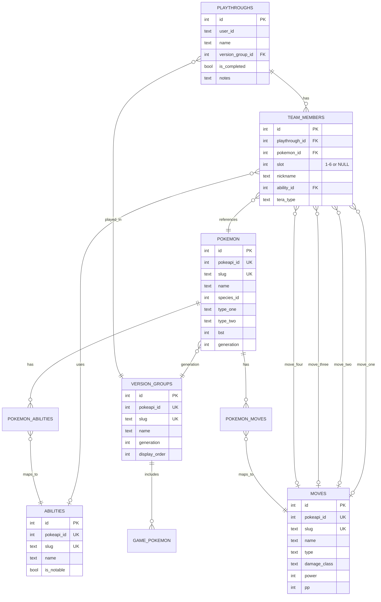

The database is a single SQLite file managed by Drizzle ORM with better-sqlite3 as the driver. `src/lib/db/schema.ts` is the source of truth for every table and column. Generated migrations live in `drizzle/` and are produced by `drizzle-kit` using the config in `drizzle.config.ts`.



## pokemon

One row per form or variant. Regional variants are separate rows: Alolan Raichu is a distinct row from base Raichu, with a different `pokeapi_id` and `slug` (e.g., `raichu-alola`).

Key columns:

- `pokeapi_id` — unique, not null. The PokéAPI numeric ID for this form.
- `species_id` — groups forms under the same species. Used by `game_pokemon` to avoid duplicating dex entries per form.
- `slug` — unique, not null. URL-safe identifier (e.g., `raichu-alola`).
- `form_name` — nullable. `Alolan`, `Galarian`, etc. Null for base forms.
- `is_default` — boolean, defaults to true. False for non-default forms.
- `type_one`, `type_two` — `type_two` is nullable for single-type Pokémon.
- `stat_hp` through `stat_spd`, `bst` — base stats and base stat total; all default to 0, populated during sync.
- `sprite_default`, `sprite_shiny` — nullable GitHub raw URLs to sprite images.
- `is_legendary`, `is_mythical`, `is_baby` — boolean flags.

## abilities

One row per ability. Populated by the sync pipeline from PokéAPI.

Key columns:

- `pokeapi_id`, `slug` — both unique, not null.
- `effect_short`, `effect_full` — nullable text. Short effect is used in the UI; full effect is stored for reference.
- `is_notable` — boolean, default false. Marks abilities worth highlighting in the UI (e.g., Swift Swim, Intimidate).

## pokemon_abilities

Join table linking a Pokémon form to its abilities.

- `pokemon_id` → `pokemon.id` with cascade delete.
- `ability_id` → `abilities.id` with cascade delete.
- `slot` — integer 1–3. Slot 3 is typically the hidden ability.
- `is_hidden` — boolean.
- Unique index on `(pokemon_id, slot)`: each Pokémon has at most one ability per slot.

## moves

One row per move.

Key columns:

- `pokeapi_id`, `slug` — both unique, not null.
- `damage_class` — `physical`, `special`, or `status`.
- `power`, `accuracy` — nullable integers. Status moves have no power; some moves have no accuracy cap.
- `pp` — not null, defaults to 0.

## pokemon_moves

Join table linking a Pokémon to the moves it can learn. Unique index on `(pokemon_id, move_id)`.

## version_groups

One row per game release group (e.g., Sword/Shield, Scarlet/Violet).

Key columns:

- `slug`, `pokeapi_id` — both unique, not null.
- `display_order` — used to sort games chronologically in the UI.
- `generation` — integer 1–9.

## game_pokemon

Links species to the games they appear in. Uses `species_id` rather than `pokemon_id` so form variants don't create duplicate dex entries.

- `version_group_id` → `version_groups.id` with cascade delete.
- `dex_number` — the regional dex number for this species in this game.
- Unique index on `(version_group_id, species_id)`.

## playthroughs

One row per user's playthrough of a game.

Key columns:

- `user_id` — text, not null. References the Better Auth `user.id` (no FK constraint — user table is managed separately by better-auth).
- `version_group_id` → `version_groups.id`. Determines which game dex is available when browsing Pokémon to add.
- `is_completed` — boolean, default false.
- `notes` — nullable free text.

## team_members

Each row is one Pokémon in a playthrough, either on the active team or on the bench. See [Bench/swap slot model](#benchswap-slot-model) below.

Key columns:

- `playthrough_id` → `playthroughs.id` with cascade delete.
- `pokemon_id` → `pokemon.id`, not null. No cascade — Pokémon rows are static reference data.
- `slot` — nullable integer. 1–6 for active team positions; null for bench.
- `nickname` — nullable.
- `ability_id` → `abilities.id`, nullable FK.
- `tera_type` — nullable text. One of the 18 type strings, for Gen 9 playthroughs.
- `move_one_id` through `move_four_id` — nullable FKs to `moves.id`. Moves are optional per slot.
- Unique index on `(playthrough_id, slot)`.

## settings

Key/value store for app configuration. `key` is the primary key. `value` is always JSON-encoded text. `description` is nullable documentation stored alongside the value.

## sync_log

Tracks each run of the PokéAPI sync pipeline.

Key columns:

- `source` — text, e.g., `pokeapi`.
- `status` — `running`, `success`, `partial`, or `error`.
- `items_processed`, `items_attempted`, `items_failed` — integer counters.
- `error_message` — nullable. Set on partial or error runs.
- `started_at`, `completed_at` — ISO timestamp strings. `completed_at` is nullable and set when the run finishes.

## Auth tables

The `user`, `session`, `account`, and `verification` tables are owned by better-auth and follow its snake_case schema. Timestamps use `integer (mode: timestamp_ms)` rather than the ISO text strings used in app tables. `session` cascades from `user`; `account` cascades from `user`. Do not edit these tables directly — use the better-auth API.

## Bench/swap slot model

`team_members.slot` is nullable by design. A non-null value (1–6) means the member occupies that position on the active team. A null value means the member is on the bench — still part of the playthrough, but not in an active slot.

The unique index on `(playthrough_id, slot)` enforces that no two active members share a slot. SQLite treats each NULL as distinct in a unique index, so multiple benched members per playthrough are allowed. This is load-bearing: without this SQLite NULL behavior, you'd need a separate `bench_members` table or a surrogate key scheme.

The swap operation in `queries.ts` (`swapTeamMember`) clears the active member's slot to null before assigning the bench member to that slot. The intermediate null is necessary to avoid a transient unique-constraint violation during the two-step update.

For the rationale behind this design and the swap API endpoint, see [Bench/Swap Data Model](/starting-six/design-decisions/bench-swap/).

## Migrations

Migration files live in `drizzle/`. As of this writing there are two: `0000_tiny_whiplash.sql` and `0001_brief_starfox.sql`.

To generate a new migration after editing `schema.ts`:

```bash
npm run db:generate
```

To apply migrations to the database:

```bash
npm run db:push
```

`drizzle.config.ts` points `drizzle-kit` at `src/lib/db/schema.ts` and outputs to `./drizzle`. The database URL defaults to `./data/starting-six.db` and can be overridden with the `DATABASE_URL` environment variable.
