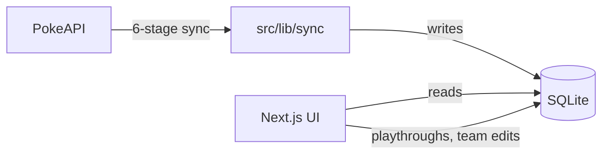

Starting Six is cache-first. All PokéAPI data is bulk-synced into a local SQLite database once, and the UI reads exclusively from SQLite after that. The app never hits PokéAPI at render time. User data — playthroughs, team members, settings — is written straight to the same SQLite database from the Next.js app.

## Data flow

The sync pipeline lives in `src/lib/sync/index.ts` and runs six stages: version groups, game dexes, species, Pokémon forms, abilities, and moves. Each stage checks existing row counts and skips if already populated, so re-running is safe.

## Tech stack

| Layer | Library | Version |
| ----- | ------- | ------- |
| Framework | Next.js | 16.2.2 |
| UI framework | React | 19.2.4 |
| Language | TypeScript | 5.6.0 |
| Database driver | better-sqlite3 | 12.8.0 |
| ORM | Drizzle ORM | 0.45.2 |
| Styling | Tailwind CSS | 3.4.0 |
| Auth | Better Auth | 1.4.18 |
| Validation | Zod | 4.3.6 |
| Testing | Vitest | 4.1.4 |
| PWA | Serwist | 9.5.7 |

## Key directories

- `src/app/` — Next.js App Router pages and API routes (dashboard, `/pokemon`, `/playthroughs`, `/settings`, `/api/sync`).
- `src/lib/` — server-side modules: `db/` (Drizzle schema + queries), `pokeapi/` (typed client), `sync/` (6-stage orchestrator), `analysis/` (pure type/role functions), `auth.ts`, `config.ts`, `validations.ts`.
- `src/components/` — React components: `layout/` (shell, sidebar, header), `pokemon/` (grid, card, type badge), `team/` (team grid, selectors), `sync/` (progress bar).

## Design choices, in one line each

- Why SQLite → [/starting-six/design-decisions/why-sqlite/](/starting-six/design-decisions/why-sqlite/)
- Bulk sync vs. live API → [/starting-six/design-decisions/bulk-sync/](/starting-six/design-decisions/bulk-sync/)
- Bench/swap data model → [/starting-six/design-decisions/bench-swap/](/starting-six/design-decisions/bench-swap/)
- Hardcoded type chart → [/starting-six/design-decisions/type-chart/](/starting-six/design-decisions/type-chart/)
