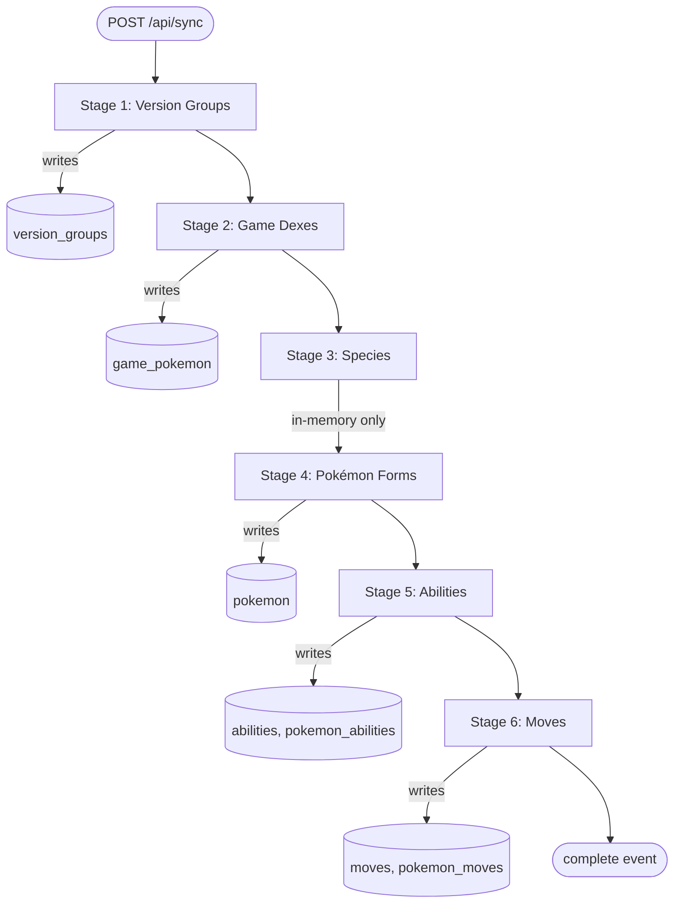

The sync pipeline (`src/lib/sync/index.ts`) pulls all PokéAPI data into local SQLite once, after which the app reads exclusively from the database. It runs six stages in sequence, triggered by a `POST /api/sync` request that returns a Server-Sent Events stream of progress updates. If a run is interrupted, restarting is safe — each stage checks for existing rows before doing any network work.

## Pipeline overview



## Stage 1: Version Groups

**Function:** `syncVersionGroups` in `src/lib/sync/games.ts`

Fetches the list of all version groups from `https://pokeapi.co/api/v2/version-group?limit=100`, then fetches the detail object for each one. Writes one row per version group to the `version_groups` table. Each row stores a slug, a human-readable display name (mapped from a hardcoded lookup table covering ~26 games), the generation number, and the PokéAPI display order.

Inserts use `.onConflictDoNothing()`. If `version_groups` already has rows when the stage starts, it returns immediately with `skipped: true`.

## Stage 2: Game Dexes

**Function:** `syncGameDexes` in `src/lib/sync/games.ts`

Reads the version groups just written to the database, then re-fetches each version group's detail from `https://pokeapi.co/api/v2/version-group/{id}/` to get its list of Pokédexes. It then fetches each Pokédex URL to collect the species entries. All `{ versionGroupId, speciesId, dexNumber }` tuples are inserted into `game_pokemon` in a single transaction via `.onConflictDoNothing()`.

The two-pass approach (first the version group list, then each group's Pokédex URLs) means this stage makes more requests than stage 1, but all fetches go through the same `fetchBatch` concurrency machinery. Skipped if `game_pokemon` already has rows.

## Stage 3: Species

**Function:** `syncSpecies` in `src/lib/sync/pokemon.ts`

Fetches the full species list from `https://pokeapi.co/api/v2/pokemon-species?limit=100`, then fetches the detail object for each species. Nothing is written to the database. Instead, the stage builds a `Map<speciesId, SpeciesMetadata>` — storing the English name, generation, legendary/mythical/baby flags, and variety URLs — and hands it to stage 4.

Because this stage writes nothing, its skip check is implicit: if stage 4 already has data, the pipeline skips stage 4 directly and passes empty junctions to stages 5 and 6.

## Stage 4: Pokémon Forms

**Function:** `syncPokemonForms` in `src/lib/sync/pokemon.ts`

Takes the species map from stage 3 and resolves every variety URL (base form, regional forms, alternate forms) into a Pokémon detail object. Fetches from each variety's URL directly. For each form it writes one row to the `pokemon` table with types, base stats, BST, sprite URLs, and display name. Display names for regional forms are resolved with `getFormName` / `buildDisplayName` — e.g., a slug of `pikachu-alola` becomes `Pikachu (Alolan)`.

Inserts use `.onConflictDoNothing()`. All writes happen inside a single `db.transaction()`. Alongside the inserts, the stage collects `PokemonJunctionData` — the ability and move references attached to each Pokémon form — and returns them to the orchestrator for stages 5 and 6.

If the `pokemon` table already has rows, the stage returns `skipped: true` with an empty junctions array, which in turn causes stages 5 and 6 to skip their junction writes (but still skip their own row inserts independently).

## Stage 5: Abilities

**Function:** `syncAbilities` in `src/lib/sync/abilities.ts`

Reads the junction data from stage 4 and collects the unique set of ability PokéAPI IDs referenced across all forms. Fetches each ability from `https://pokeapi.co/api/v2/ability/{id}/` and writes to `abilities` (slug, display name, short effect, full effect, and an `isNotable` flag set against a hardcoded list of ~56 competitively relevant abilities). Then builds the `pokemon_abilities` junction rows — each linking a `pokemon.id` to an `abilities.id` with slot number and hidden-ability flag — via `.onConflictDoNothing()`.

The skip logic checks both tables independently. If `abilities` is populated but `pokemon_abilities` is not, it skips the ability detail fetches and goes straight to writing junctions.

## Stage 6: Moves

**Function:** `syncMoves` in `src/lib/sync/moves.ts`

Mirrors the structure of stage 5. Collects unique move IDs from the junction data, fetches each from `https://pokeapi.co/api/v2/move/{id}/`, and writes to `moves` (slug, display name, type, damage class, power, accuracy, PP, short effect). Then writes `pokemon_moves` junction rows. All inserts use `.onConflictDoNothing()`.

Same independent skip check: if `moves` is populated but `pokemon_moves` is empty, the detail fetch step is skipped and only the junctions are written.

## Concurrency and rate limiting

All bulk fetches go through `fetchBatch` in `src/lib/pokeapi/client.ts`. The constants are:

| Constant | Value |
| --- | --- |
| `BATCH_SIZE` | 10 |
| `BATCH_DELAY_MS` | 100 ms |
| `MAX_RETRIES` | 3 |

Within each batch, `Promise.allSettled` runs all 10 requests concurrently. After each batch completes, `fetchBatch` waits 100ms before starting the next one (except the final batch). Settled rejections are filtered out rather than thrown, so one bad request in a batch does not abort the rest.

Retry logic lives in `fetchWithRetry`. On a non-2xx response or network error, it waits `1000 * 2^attempt` milliseconds before the next attempt — 1s, 2s, then 4s. After three attempts it throws, which `fetchBatch` catches via `Promise.allSettled` and counts as a failed item.

Pagination uses `fetchAllPages`, which fetches `?limit=100` pages sequentially until `page.next` is null. Pagination requests go through `fetchWithRetry` but are not batched — they run one page at a time since each page is a single cheap list request.

## SSE progress events

`POST /api/sync` returns a `text/event-stream` response immediately. The route (`src/app/api/sync/route.ts`) calls `runFullSync` with a progress callback and pipes three event types to the stream:

**`progress`** — emitted after each batch completes within a stage:

```json
{ "stage": 3, "stageName": "Species", "processed": 50, "total": 1025 }
```

**`complete`** — emitted when all six stages finish:

```json
{ "status": "success", "totalProcessed": 12345, "totalFailed": 0, "stages": [...] }
```

The `status` field is `"success"` if no items failed, `"partial"` if some failed, and `"error"` if the pipeline threw.

**`error`** — emitted if `runFullSync` throws an unhandled exception:

```json
{ "message": "..." }
```

The route guards against concurrent runs with a module-level `syncInProgress` flag. A second `POST` while a sync is running returns a 400 with the message `"A sync is already in progress"`.

## Resumability

Every stage checks row counts at the start. If the relevant table(s) already have data, the stage sets `skipped: true` in its `StageResult` and returns immediately without making any network requests. The orchestrator still accumulates the result and continues to the next stage.

The one cross-stage dependency is between stages 3 and 4. If stage 4 skips (because `pokemon` already has rows), it returns an empty junctions array. Stages 5 and 6 each check their own tables independently, so they may still run to fill in junction rows if those were missing.

The result is that re-running a fully completed sync does almost no work — all six stages skip — while re-running a partially completed sync resumes from the first stage that has incomplete data.

## Triggering sync

The route is `POST /api/sync` and requires an authenticated session — the handler calls `requireUserIdFromRequest` and returns 401 otherwise. The request body is validated against `syncTriggerSchema` (defined in `src/lib/validations.ts`); a malformed body returns 400.

In the UI, the sync button is on the system settings page at `/settings/system`. There is no demo-mode env gate in the sync route itself; demo-mode blocking happens at the proxy layer before the request reaches the route handler.

---

For the user-facing view of the sync experience — progress bar, timing, and what to do after it completes — see [First run](/starting-six/getting-started/first-run/).

For why the app does a one-time bulk sync instead of fetching PokéAPI at render time, see [Bulk sync vs. live API](/starting-six/design-decisions/bulk-sync/).
