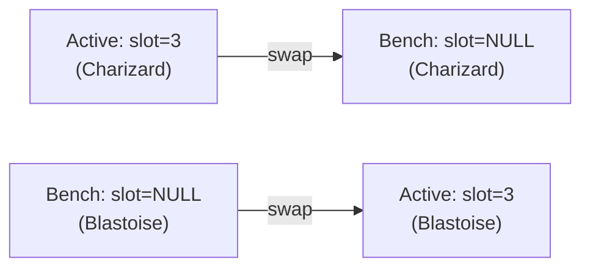

The `team_members` table holds both active team members (slot 1–6) and benched ones (slot `NULL`) in a single table. One row per Pokémon per playthrough; the `slot` column is the only thing that distinguishes "on the field" from "sitting out."



## The schema

From `src/lib/db/schema.ts`:

```ts
export const teamMembers = sqliteTable('team_members', {
  // ...
  slot: integer('slot'), // 1-6 for active team, null for bench
  // ...
}, (table) => ({
  playthroughSlotIdx: uniqueIndex('playthrough_slot_idx').on(table.playthroughId, table.slot),
}));
```

A few things to note here:

`slot` has no `.notNull()`, so SQLite stores it as `NULL` for bench members. There is no application-level check constraint enforcing the 1–6 range — the comment documents the convention, and the swap validation schema enforces it at the API boundary (`z.number().int().min(1).max(6)` in `swapTeamMemberSchema`).

The `uniqueIndex('playthrough_slot_idx')` is on `(playthrough_id, slot)`. This prevents two active members from occupying the same slot. It does not prevent multiple bench members per playthrough, because SQLite treats each `NULL` as distinct when evaluating a unique index — two rows with `slot = NULL` don't conflict. That behavior is what makes the single-table design work cleanly.

## The swap endpoint

`POST /api/playthroughs/[id]/team/swap`

Request body:

```json
{
  "benchMemberId": 42,
  "activeSlot": 3
}
```

`benchMemberId` is the row ID of the member currently on the bench. `activeSlot` is the slot number (1–6) to swap into.

The `swapTeamMember` function in `src/lib/db/queries.ts` executes two sequential updates. First, it looks up the active member currently occupying that slot. Then, if one exists, it sets that member's `slot` to `NULL` — clearing the slot before it's written again. After that, it sets the bench member's `slot` to `activeSlot`.

There's an important subtlety here: because the unique index covers `(playthrough_id, slot)`, you cannot move the bench member into the slot while the active member still holds it. The code resolves this by clearing the active member's slot in a separate `UPDATE` before assigning the slot to the bench member. The two writes are not wrapped in a Drizzle transaction — they're sequential calls to `db.update(...).run()`. SQLite's default serialized write behavior means concurrent modification isn't a practical concern in this single-process app, but it's worth knowing the swap is not formally atomic.

If the target slot is currently empty (no active member occupies it), the function skips the first update and just promotes the bench member directly.

The endpoint validates that `benchMemberId` belongs to the playthrough and that the member's slot is actually `NULL` before proceeding. Passing an already-active member as `benchMemberId` throws `'Member is not on the bench'` at the query layer.

## Why this design

A single table keeps the roster query simple. `SELECT * FROM team_members WHERE playthrough_id = ?` returns every member for a playthrough in one shot. Sorting by `slot NULLS LAST` puts active members first, bench members after. No joins, no union of two tables.

It also reflects the domain accurately. A bench member and an active member are the same thing — a Pokémon in a playthrough — with different availability. Splitting them into two tables would duplicate the concept and require moving rows on every swap rather than updating a single integer column.

Moves, ability, Tera type, and nickname stay on the row throughout. Nothing is lost when a member moves to the bench.

## Migration pattern

The bench feature was introduced in `drizzle/0001_brief_starfox.sql`. The migration recreates the `team_members` table without `NOT NULL` on the `slot` column (the initial schema had slot as non-nullable), copies all existing rows across, drops the old table, renames the new one, and then creates the `playthrough_slot_idx` unique index on `(playthrough_id, slot)`.

The recreate-and-copy approach is SQLite's standard way to change column constraints — `ALTER TABLE ... DROP CONSTRAINT` isn't supported, so the migration uses the `CREATE TABLE / INSERT INTO ... SELECT / DROP / RENAME` pattern.

---

For the full schema see [Database schema](/starting-six/architecture/database-schema/).

For the UI flow (add, bench, swap), see [Playthroughs and team builder](/starting-six/features/playthroughs-team-builder/).
